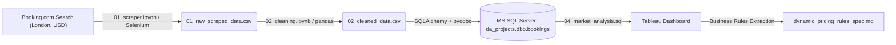
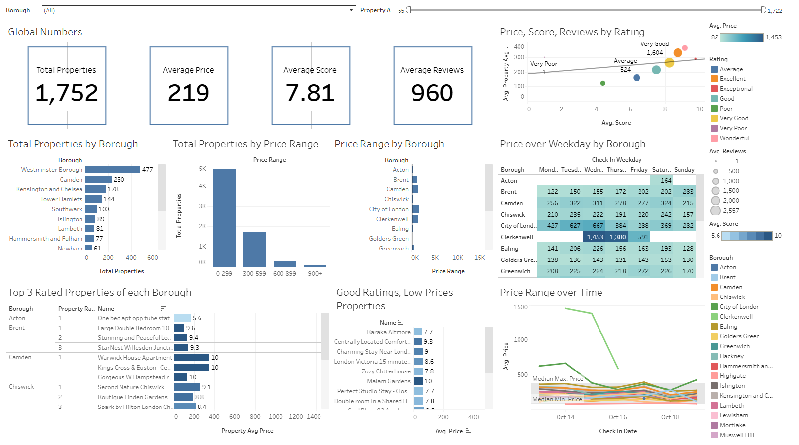

# London Hospitality Market Intelligence & Dynamic Pricing Specification

**Role Focus:** Data Engineering & Analysis (Python, Selenium, MS SQL Server, Tableau) | Technical Business Analysis (Data Modeling, Pricing Business Rules, Agile Specs)

> **Quick Navigation:**
>
> - **For Data Teams:** [ETL Pipeline & Incremental Ingestion](#2-data-pipeline--architecture) | [SQL Market Analysis & Tableau Dashboard](#3-sql-exploratory-analysis--market-insights)
> - **For Product & BA Teams:** [Executive Problem Statement](#1-executive-problem-statement) | [Dynamic Pricing Decision Table](#4-proposed-product-solution--business-rules) | [User Stories & KPI Framework](#5-agile-user-stories--kpi-framework)

---

## 1. Executive Problem Statement

Independent property hosts and hospitality managers in London often rely on static nightly pricing, leaving revenue on the table during peak demand or losing occupancy in saturated boroughs. This project builds an automated web scraping and SQL analytics pipeline across **6,885 scraped London property records** on Booking.com, translating borough-level price elasticity and rating benchmarks into a **Dynamic Pricing Engine Specification**.

- **Analytical Baseline:** Engineered a multi-run scraping pipeline capturing **6,885 property records** across **23+ London boroughs** (with a single check-in date snapshot capturing ~643 unique properties at an average nightly rate of **$301.98 USD**, median **$245.00 USD**, and median guest score of **8.0/10**).
- **What-If Opportunity Sizing (Dataset Simulation):** Across `dbo.bookings`, **26.82%** of top-rated properties (`score >= 8.5`) are priced below their respective borough median by an average of **$53.62 USD/night**. Adjusting weekend rates to match the borough median across 8 peak Friday/Saturday nights per month represents an estimated **$428.93 USD monthly revenue lift per property** without requiring occupancy increases.

<details>
<summary><b> SQL Logic Used for Opportunity Sizing </b></summary>

```sql
WITH borough_medians AS (
    SELECT property_id,
           borough,
           score,
           price,
           PERCENTILE_CONT(0.5) WITHIN GROUP (ORDER BY price) OVER (PARTITION BY borough) AS borough_median_price
    FROM dbo.bookings
)
SELECT CAST(ROUND((SUM(CASE WHEN price < borough_median_price THEN 1 ELSE 0 END) * 100.0) / COUNT(*), 2) AS FLOAT) AS pct_underpriced_top_rated,
       ROUND(AVG(CASE WHEN price < borough_median_price THEN borough_median_price - price END), 2) AS avg_nightly_lift,
       ROUND(AVG(CASE WHEN price < borough_median_price THEN (borough_median_price - price) * 8 END), 2) AS monthly_weekend_lift
FROM borough_medians
WHERE score >= 8.5;
```

</details>

---

## 2. Data Pipeline & Architecture



- **Automated Extraction:** Built dynamic search URLs in Python targeting 1-night, 2-adult London stays in `USD`. Programmatically dismissed sign-in overlays, executed iterative scroll-and-click pagination, and parsed property cards.
- **Cleaning & Feature Engineering:**
  - Deduplicated records and standardized schema names.
  - Extracted unique `property_id` slugs and split `location` into `borough` and `city` (handling city-only strings and setting missing boroughs to `'Unknown'`).
  - Parsed multi-line rating strings into numerical `score`, `reviews` and categorical `rating`, applying `pd.cut` to classify sub-7.0 scores into `'Very Poor'` (`0–2.99`), `'Poor'` (`3.0–4.99`), and `'Average'` (`5.0–6.99`), while flagging unreviewed listings as `'No Reviews'`.
  - Derived `check_in_weekday` and appended cleaned batches to both `cleaned_data.csv` and **MS SQL Server** (`da_projects.dbo.bookings`) using `SQLAlchemy`.

---

## 3. SQL Exploratory Analysis & Market Insights



Using **MS SQL Server**, 8 core business questions (`Q1–Q8`) were analyzed using CTEs and window functions:

1. **Borough Supply Concentration (`Q1` & `Q2`):** Supply is heavily concentrated in central hubs like **Westminster Borough** (~28.8% of single-day listings), while window functions (`MEDIAN`, `MIN`, `AVG`, `MAX` partitioned by `borough`) reveal wide gaps between mean (**$301.98**) and median (**$245.00**) nightly rates due to luxury outliers (up to **$1,491/night**).
2. **Market Price Segmentation (`Q3`):** Grouping properties into four price brackets (`$0–299`, `$300–599`, `$600–899`, `$900+`) shows the majority of London inventory competes in the `$0–299` and `$300–599` tiers.
3. **Temporal & Weekday Rate Elasticity (`Q4` & `Q5`):** Tracking rates across `check_in_date` and chronological `check_in_weekday` exposes flat-rate pricing habits among independent hosts across weekdays vs. weekends.
4. **Rating Tier & Credibility Benchmarks (`Q6`, `Q7` & `Q8`):** Isolating the latest property snapshot, **Q7** ranks the Top 3 properties per borough filtered for credible review volume (`reviews > 50`), while **Q8** isolates high-value underpriced listings (`score > 7` priced below `borough_avg_price`).

---

## 4. Proposed Product Solution & Business Rules

To operationalize `Q7`, `Q8`, and the What-If median analysis into a Property Management System (PMS) feature, the following **Dynamic Pricing Decision Table** governs automated host rate alerts:

| Rule ID   | Guest Score (`score`)      | Review Volume (`reviews`) | Stay Day (`check_in_weekday`) | Current `price` vs. Borough Benchmark | System Rate Recommendation             | Business Rationale                                                                                   |
| :-------- | :------------------------- | :------------------------ | :---------------------------- | :------------------------------------ | :------------------------------------- | :--------------------------------------------------------------------------------------------------- |
| **PR-01** | `>= 8.5` (Excellent)       | `> 50`                    | `Friday` / `Saturday`         | `price < borough_median_price`        | **Match Borough Median (+$53.62 avg)** | Captures peak weekend willingness-to-pay for proven top-tier properties (`$53.62/mo` lift).          |
| **PR-02** | `> 7.0` to `8.4`           | `> 50`                    | `Monday` – `Thursday`         | `price < borough_avg_price` (Q8)      | **Nudge +5% toward Borough Avg**       | Closes underpricing gap on credible `"Good"` / `"Very Good"` weekday inventory.                      |
| **PR-03** | `0.0` (`No Reviews`)       | `< 50`                    | `Monday` – `Thursday`         | `price >= borough_median_price`       | **Apply -10% Penetration Promo**       | Accelerates initial bookings for cold-start properties until they cross the `50+ reviews` threshold. |
| **PR-04** | `< 7.0` (`Average`/`Poor`) | `Any`                     | `Any`                         | `price > borough_median_price`        | **Cap at Borough 25th Percentile**     | Prevents occupancy stagnation for sub-7.0 properties identified in `pd.cut` tiers.                   |

---

## 5. Agile User Stories & KPI Framework

### User Story 1: Automated Weekend Rate Optimization Alert (`PR-01`)

- **As a** London Property Host with a `score >= 8.5` and `reviews > 50`,
- **I want** to receive an automated pricing prompt when my weekend nightly rate falls below my borough's median rate,
- **So that** I can capture an estimated **$428.93 USD/month** in unrealized peak weekend revenue without manual competitor research.
- **Acceptance Criteria (Given / When / Then):**
  - **Given** a property’s latest scraped record (`last_scraped = 1`) has `score >= 8.5` and `reviews > 50`,
  - **When** the listing's `price` for an upcoming Friday or Saturday `check_in_date` is less than `borough_median_price`,
  - **Then** surface a _"Weekend Rate Opportunity"_ alert on the Host Dashboard displaying the exact `$Price_Gap` (`borough_median_price - price`) and a one-click **"Match Borough Median"** action button.

### Proposed KPI Monitoring Framework

| Metric Category          | Metric Name                       | SQL / BI Calculation Logic                                | Target Objective                                                           |
| :----------------------- | :-------------------------------- | :-------------------------------------------------------- | :------------------------------------------------------------------------- |
| **North Star KPI**       | **Host RevPAR Lift (USD)**        | `Total_Booking_Revenue_USD / Total_Available_Room_Nights` | Measure net revenue yield per available night after pricing rule adoption. |
| **Product Adoption KPI** | **Rule Acceptance Rate**          | `Accepted_Rate_Recommendations / Total_Prompts_Triggered` | Track host adoption across `PR-01` through `PR-04`.                        |
| **Guardrail KPI**        | **Cold-Start Velocity (`PR-03`)** | `Days to reach reviews > 50` for `'No Reviews'` listings  | Verify that weekday penetration discounts accelerate review accumulation.  |

---
