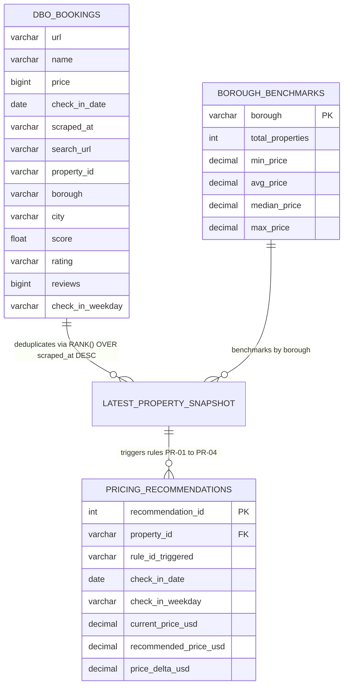
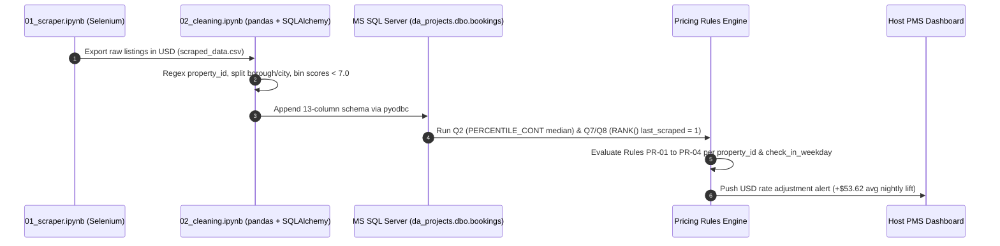

# Functional & Technical Specification: Dynamic Pricing Recommendation Engine

<!-- **Document ID:** FSD-BK-2026-10   -->
<!-- **Author:** Nguyen Thu Thao   -->

**Role:** Technical Business Analyst / Data Analyst  
**Source Database:** MS SQL Server (`da_projects.dbo.bookings` — 6,885 Scraped Records in USD)  
**Status:** Case Study Specification (Pre-Implementation Baseline)

---

## 1. Document Purpose & Business Context

Hospitality managers across London boroughs face high price dispersion (nightly rates ranging from **$55 to $1,491 USD**, with a citywide mean of **$301.98** and median of **$245.00**).

Using automated Python/Selenium extraction, pandas preprocessing, and SQL window-function analysis, we identified that **26.82%** of top-rated properties (`score >= 8.5`) price their rooms below their respective borough median by an average of **$53.62 USD/night**. This document specifies the database schema, deduplication logic, decision rules, and functional requirements for an **Automated Dynamic Pricing Recommendation Engine**.

---

## 2. Data Architecture & Entity-Relationship Diagram (ERD)

Because the scraper appends multi-date search snapshots into `dbo.bookings`, the pricing engine uses a two-layer architecture: raw historical snapshots in `dbo.bookings` feed deduplicated property profiles (`last_scraped = 1`) and borough-level aggregations.

---

## 3. System Sequence Diagram (ETL to Recommendation Engine)

---

## 4. Data Dictionary (`dbo.bookings`)

| Column Name          | SQL / Pandas Dtype  | Derivation & Cleaning Logic (`02_cleaning.ipynb`)                                                                | Null Handling / Constraints                           |
| :------------------- | :------------------ | :--------------------------------------------------------------------------------------------------------------- | :---------------------------------------------------- |
| `property_id`        | `VARCHAR` (`str`)   | Extracted from `url` via regex `r'hotel/[^/]+/([^./]+)'`                                                         | `NOT NULL` (Deduplicated per batch via `url`)         |
| `name`               | `VARCHAR` (`str`)   | Scraped from `[data-testid="title"]`                                                                             | `NOT NULL`                                            |
| `borough`            | `VARCHAR` (`str`)   | Split from `location` on `', '`; shifted if only `'London'`                                                      | `NULL` filled with `'Unknown'` (23 distinct boroughs) |
| `city`               | `VARCHAR` (`str`)   | Second token of `location` split (`'London'`)                                                                    | `NOT NULL`                                            |
| `price`              | `BIGINT` (`int64`)  | Stripped `'US$'` and `','` via regex `r'\d+(?:\.\d+)?'`                                                          | Cast to numeric (`$55` – `$1,491` USD range)          |
| `score`              | `FLOAT` (`float64`) | Extracted from 2nd line of `[data-testid="review-score"]`                                                        | `NULL` filled with `0.0` (`0.0` – `10.0` scale)       |
| `rating`             | `VARCHAR` (`str`)   | Native tier (`Good`, `Very Good`, `Excellent`, etc.) + `pd.cut` for `score < 7` (`Very Poor`, `Poor`, `Average`) | `NULL` filled with `'No Reviews'` (8 distinct tiers)  |
| `reviews`            | `BIGINT` (`Int64`)  | Stripped non-digits via `r'[^\d.]'`                                                                              | `NULL` filled with `0` (`0` – `37,427` reviews)       |
| `check_in_date`      | `DATE` (`object`)   | Dynamic target stay date (`datetime.now() + timedelta(days=14)`)                                                 | `NOT NULL` (`YYYY-MM-DD`)                             |
| `check_in_weekday`   | `VARCHAR` (`str`)   | Derived via `pd.to_datetime(check_in_date).dt.day_name()`                                                        | Chronologically ordered in SQL via `DATEDIFF % 7`     |
| `scraped_at`         | `VARCHAR` (`str`)   | ISO timestamp (`datetime.now().isoformat()`)                                                                     | Used in SQL `RANK() OVER (ORDER BY scraped_at DESC)`  |
| `url` / `search_url` | `VARCHAR` (`str`)   | Property permalink and query string URL                                                                          | `NOT NULL`                                            |

---

## 5. Business Logic Decision Table

The rules engine combines **Q2 (Borough Medians)**, **Q3 (Price Brackets)**, **Q5 (Weekday Trends)**, **Q7 (`reviews > 50` Credibility Filter)**, and **Q8 (Value Discovery)**:

| Rule ID   | Target Segment                  | `score` & `rating` Condition                             | `reviews` Condition | `check_in_weekday`    | Price Position Condition        | Recommended Action (USD)                                                       |
| :-------- | :------------------------------ | :------------------------------------------------------- | :------------------ | :-------------------- | :------------------------------ | :----------------------------------------------------------------------------- |
| **PR-01** | Underpriced Top Performers      | `score >= 8.5`                                           | `reviews > 50`      | `Friday`, `Saturday`  | `price < borough_median_price`  | **Raise to `borough_median_price`** (captures `+$53.62/night`, `+$428.93/mo`). |
| **PR-02** | Underpriced Value Listings (Q8) | `score > 7.0` AND `< 8.5`                                | `reviews > 50`      | `Monday` – `Thursday` | `price < borough_avg_price`     | **Increase `price` by +5% to +10%** (capped at `borough_median_price`).        |
| **PR-03** | Cold-Start / Unreviewed Hosts   | `rating == 'No Reviews'` (`score == 0`)                  | `reviews <= 50`     | `Monday` – `Thursday` | `price >= borough_median_price` | **Apply -10% Penetration Discount** until property exceeds 50 reviews.         |
| **PR-04** | Low-Score Overpriced Listings   | `score > 0` AND `< 7.0` (`Average`, `Poor`, `Very Poor`) | `Any`               | `Any`                 | `price > borough_median_price`  | **Reduce `price` to Borough 25th Percentile** to protect occupancy.            |

---

## 6. Functional Requirements & Edge-Case Handling

- **FR-01 (Latest Snapshot Isolation):** Because `dbo.bookings` stores historical multi-scrape appends, all pricing rules MUST first filter records through the `ranked_scraped` CTE (`RANK() OVER (PARTITION BY property_id ORDER BY scraped_at DESC) = 1`) before calculating property averages.
- **FR-02 (`'Unknown'` Borough Fallback):** For records where `borough = 'Unknown'` (listings that only displayed `'London'` on Booking.com), the system shall fall back to the **Citywide London Median Price (`$245.00 USD`)** instead of partitioning by `'Unknown'`.
- **FR-03 (Price Bracket Guardrail):** In alignment with **Q3** price segmentation (`0-299`, `300-599`, `600-899`, `900+`), automated single-day upward rate recommendations under `PR-01` shall not push a property across more than one price bracket without explicit host confirmation.

---

## 7. Agile User Stories & Acceptance Criteria

### User Story 1: Peak Weekend Underpricing Recommendation (`PR-01`)

- **As a** London Property Host with a proven track record (`score >= 8.5` and `reviews > 50`),
- **I want** the system to flag when my Friday/Saturday rate is below my borough's median price,
- **So that** I can capture an estimated **$428.93 USD/month** in additional weekend revenue.
- **Acceptance Criteria (Given / When / Then):**
  - **Given** a property record with `last_scraped = 1`, `score >= 8.5`, `reviews > 50`, and `borough != 'Unknown'`,
  - **When** `price < PERCENTILE_CONT(0.5) WITHIN GROUP (ORDER BY price) OVER (PARTITION BY borough)` for a Friday or Saturday `check_in_date`,
  - **Then** display a pricing alert showing `Current Price ($price)`, `Borough Median ($borough_median_price)`, and a one-click button to apply the `+$53.62` adjustment.

### User Story 2: Cold-Start Review Velocity Booster (`PR-03`)

- **As a** new host whose listing is currently marked as `rating = 'No Reviews'` or has `reviews <= 50`,
- **I want** the system to recommend a competitive weekday entry rate below the borough median,
- **So that** I can attract my first 50 verified guest reviews and qualify for Top-3 Borough visibility (`Q7`).
